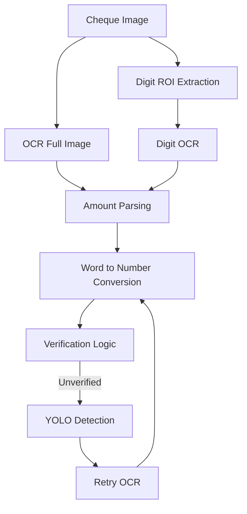
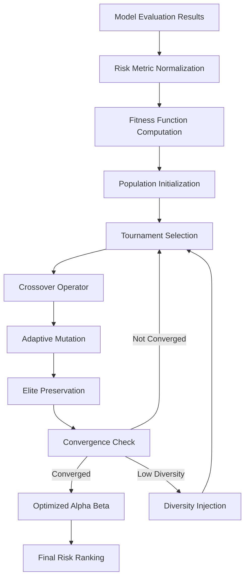
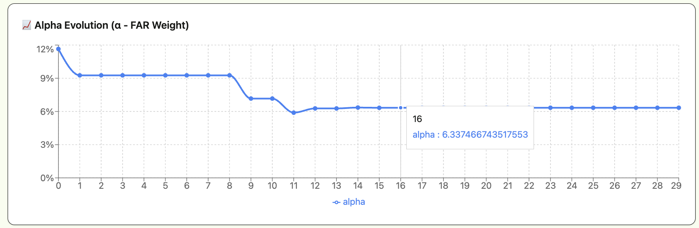
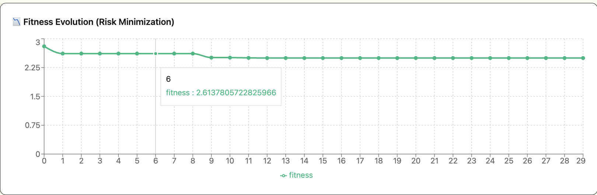
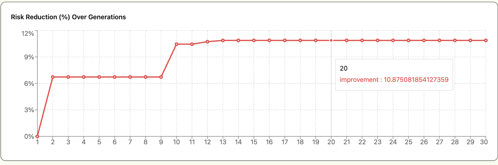

# **Fincheck — Confidence-Aware Cheque Digit Validation System**
[](https://mukesh1352.github.io/fincheck-next/)
[](https://github.com/mukesh1352/fincheck-next)


**Risk-Aware Handwritten Digit Verification for Financial Documents**

**Frontend:** Next.js (Bun)
**Backend:** FastAPI + PyTorch + OpenCV
**Storage & Reports:** MongoDB + ReportLab

---

## Abstract

Traditional OCR and digit-recognition systems optimize for accuracy and always emit a prediction. In financial workflows such as cheque processing, **a wrong prediction is more dangerous than no prediction**.

**Fincheck** reframes handwritten digit recognition as a **risk evaluation problem** rather than an accuracy problem. The system:

* Quantifies prediction confidence and uncertainty
* Computes FAR/FRR and a risk score
* Rejects ambiguous inputs instead of guessing
* Enables human-in-the-loop verification
* Provides auditability via PDF reports and database logging

Fincheck is **not an OCR engine**. It is a **confidence-aware digit validity filter** for financial systems.

In addition, Fincheck evaluates model robustness under distribution shift by
benchmarking the same compressed architectures on the CIFAR dataset.
This enables comparison between **in-distribution safety (MNIST)** and
**out-of-distribution generalization (CIFAR)**, revealing which compression
methods degrade gracefully under real-world visual complexity.

---

## Core Principle

> **If the system is not confident, it must refuse.**  
> **A model that performs well only on MNIST but collapses under CIFAR is considered unsafe for real-world deployment.**

---

# 🧠 System Architecture

---

## 🔹 System Architecture I

### Confidence-Aware Digit Validation Pipeline (MNIST Risk Filter)

```mermaid
flowchart TD
    A[User Image Upload]
    B[Preprocessing - OpenCV]
    C[Digit Segmentation]
    D[MNIST Normalization 28x28]
    E[MNIST CNN Models]
    F[Confidence Entropy Stability]
    G[FAR FRR Risk Score]
    H[VALID / AMBIGUOUS / INVALID]

    A --> B
    B --> C
    C --> D
    D --> E
    E --> F
    F --> G
    G --> H
````

**Purpose:**
Safely validate handwritten digits by rejecting low-confidence or ambiguous predictions instead of guessing.

---

## 🔹 System Architecture II

### MNIST vs CIFAR Compression Robustness Comparison

```mermaid
flowchart TD
    A[Dataset Input]
    B[Optional Stress Perturbations]
    C[Batch Inference]

    D1[MNIST Models]
    D2[CIFAR Models]

    E[Metrics Extraction]
    F[FAR FRR Risk Score]
    G[Generalization Comparison]

    A --> B
    B --> C
    C --> D1
    C --> D2
    D1 --> E
    D2 --> E
    E --> F
    F --> G
```

### **Purpose**

Compare compressed model safety under **in-distribution (MNIST)** and **out-of-distribution (CIFAR)** conditions to expose robustness gaps.

---

## 🔹 System Architecture III

### Cheque Amount Verification (Digits + Text + YOLO Fallback)


**Purpose:**
Verify cheque amounts by cross-checking numeric and written values with a safe fallback mechanism.

---

## 🔹 System Architecture IV

### Evolutionary Risk Weight Optimization Engine



### **Purpose**

Automatically learn the optimal balance between:

* FAR (False Acceptance Rate)
* FRR (False Rejection Rate)

Instead of manually selecting risk weights, the system evolves alpha (α) using an adaptive genetic strategy.

---

## Why MNIST Is Used

MNIST is not used to recognize cheques.
It serves as a **digit shape manifold prior**.

Digits that do not resemble canonical handwritten digits result in:

* Low confidence
* High entropy
* Automatic rejection

MNIST acts as a **risk filter**, not an OCR system.

CIFAR is intentionally more complex and visually diverse than MNIST.
While MNIST measures digit plausibility and safety, CIFAR is used to
evaluate how compression techniques generalize under higher visual entropy.

A safe model should perform well on MNIST and degrade gracefully on CIFAR.
CIFAR results are interpreted only after MNIST acceptance, never as a standalone decision signal.

---

## Digit Segmentation Pipeline

1. Grayscale conversion
2. Stroke enhancement (morphological close)
3. Otsu thresholding and inversion
4. Connected component extraction
5. Geometric filtering (area, width, height)
6. Left-to-right ordering
7. MNIST normalization:

   * Tight crop
   * Aspect-ratio safe resize
   * 28×28 canvas
   * Center-of-mass alignment

Segmentation is treated as a **risk control stage**. Borderline components are rejected.

## Multi-Model Inference

All models are loaded at startup and evaluated in parallel:

| Model               | Technique              |
| ------------------- | ---------------------- |
| baseline_mnist.pth  | Standard CNN           |
| kd_mnist.pth        | Knowledge Distillation |
| lrf_mnist.pth       | Low Rank Factorization |
| pruned_mnist.pth    | Weight Pruning         |
| quantized_mnist.pth | Quantization           |
| ws_mnist.pth        | Weight Sharing         |

This allows model comparison using **risk metrics**, not just accuracy.

The same compression techniques are mirrored for CIFAR:

| Model               | Dataset | Purpose                    |
|--------------------|---------|----------------------------|
| baseline_cifar.pth | CIFAR   | Generalization baseline    |
| kd_cifar.pth       | CIFAR   | Distilled robustness test  |
| lrf_cifar.pth      | CIFAR   | Low-rank stress behavior   |
| pruned_cifar.pth   | CIFAR   | Sparsity degradation test  |
| quantized_cifar.pth| CIFAR   | Precision sensitivity test |
| ws_cifar.pth       | CIFAR   | Shared-weight robustness   |

MNIST and CIFAR results are never merged; they are compared to expose
robustness gaps introduced by compression.

---

## Risk Metrics

Fincheck evaluates models using:

* **Confidence** — mean max softmax probability
* **Entropy** — prediction uncertainty
* **Stability** — logit variance
* **Latency** — inference time
* **FAR** — False Accept Rate
* **FRR** — False Reject Rate

**Risk Score**

```
Risk = 0.5 × FAR + 0.5 × FRR
```

Lower risk score is preferred over higher accuracy.

---
# Evolutionary Risk Optimization Framework (ERO)

---

# 1. Motivation

Traditional model selection primarily optimizes **classification accuracy**.
However, in financial systems such as cheque validation and fraud-sensitive environments, accuracy alone is insufficient for safe deployment.

Two models may achieve identical accuracy while exhibiting drastically different financial risk exposure in terms of:

* **False Accept Rate (FAR)** — Fraud liability risk
* **False Reject Rate (FRR)** — Operational friction and customer dissatisfaction

In cheque validation systems:

* High FAR → Direct financial fraud exposure
* High FRR → Customer inconvenience and operational inefficiency

Therefore, Fincheck reformulates model selection as a **financial risk minimization problem**, not merely an accuracy comparison problem.

---

# 2. Risk Formulation

For each model `m`, financial risk is defined as:

R_m(α) = α · FAR_m + (1 − α) · FRR_m

Where:

* ( FAR_m ) = False Accept Rate of model ( m )
* ( FRR_m ) = False Reject Rate of model ( m )
Where:

- α ∈ (0,1) represents the safety-weighting parameter  
- β = 1 − α represents the complementary weight

This produces a weighted composite financial risk score reflecting the trade-off between fraud sensitivity and rejection strictness.

---

# 3. Why Alpha Must Be Learned

Manually selecting ( \alpha ):

* Is arbitrary
* Is institution-dependent
* Is dataset-sensitive
* May introduce hidden bias

Rather than fixing ( \alpha = 0.5 ), Fincheck **learns ( \alpha )** using an evolutionary strategy.

Thus, risk calibration becomes:

* Data-driven
* Adaptive
* Reproducible
* Explainable

Importantly:

> Alpha is not treated as a hyperparameter — it is treated as a learned financial policy indicator.

---

# 4. Optimization Objective

The evolutionary process solves:

α* = argmin_{α ∈ (0,1)}  Σ_{m=1}^{M} R_m(α)

This transforms model comparison into a continuous scalar optimization problem over a financial policy parameter.

---

# 5. Representation

Each individual in the evolutionary population represents a scalar:

α ∈ (0,1)

Example initial population:

```
[0.12, 0.48, 0.63, 0.29, 0.81, ...]
```

Each candidate ( \alpha ) is evaluated using a stabilized financial fitness function.

---

# 6. Stabilized Research-Grade Fitness Function

A naïve linear objective:

Weighted Risk = α · FAR + (1 − α) · FRR

often leads to:

* Boundary collapse (α → 0 or 1)
* Metric dominance
* Poor numerical stability

Fincheck therefore introduces stabilization components.

---

## 6.1 Proper Normalization

Instead of simple ratio normalization, we apply symmetric normalization:

FAR_n = FAR_m / (FAR_m + FRR_m + ε)

where ε > 0 is a small constant introduced to prevent numerical instability.

This normalization:

- Eliminates magnitude bias between FAR and FRR  
- Produces scale-invariant ratios  
- Improves convergence stability during optimization
---
## 6.2 Logarithmic Compression

We apply logarithmic compression to stabilize optimization:

L(α) = α · log(FAR_n + ε) + (1 − α) · log(FRR_n + ε)

Where:
- ε is a small constant to prevent log(0)

Benefits:
- Dampens extreme outliers  
- Smooths the optimization surface  
- Improves convergence stability  
- Reduces domination by skewed error distributions
---
## 6.3 Interior Regularization

To prevent collapse toward extreme policies, we introduce quadratic regularization:

λ · (α − 0.5)²

Where:
- λ controls regularization strength

This encourages interior solutions and prevents trivial single-objective dominance.
---
## 6.4 Soft Boundary Barrier

To prevent α from reaching the unstable boundaries 0 or 1, we apply a soft barrier:

γ · [ 1 / (α + ε) + 1 / (1 − α + ε) ]

Where:
- γ controls barrier intensity  
- ε prevents division-by-zero  

This ensures:
- Numerical stability  
- Balanced financial calibration  
- Avoidance of degenerate policy collapse
---
## Final Fitness Definition

The complete stabilized objective function is:

Fitness(α) =
Σ (over m = 1 to M) [
  α · log(FAR_n + ε)
  +
  (1 − α) · log(FRR_n + ε)
]
+
λ · (α − 0.5)²
+
γ · [ 1 / (α + ε) + 1 / (1 − α + ε) ]

Where:

- M = number of models  
- ε = small constant for numerical stability  
- λ = interior regularization strength  
- γ = boundary barrier strength  

Lower fitness → safer calibration.

This objective is:

* Smooth
* Differentiable (almost everywhere)
* Well-conditioned
* Interior-stable

---

# 7. Evolutionary Algorithm Design

## 7.1 Generation Cycle

Each generation performs:

1. Fitness evaluation
2. Tournament selection
3. Biased crossover
4. Adaptive mutation
5. Elite preservation
6. Population replacement

---

## 7.2 Population Size

Default: 20

Trade-off:

* Larger population → stronger exploration
* Smaller population → faster convergence

---

## 7.3 Tournament Selection (k = 3)

* Randomly sample 3 individuals
* Select the best among them

Advantages:

* Maintains diversity
* Reduces premature convergence
* Introduces stochastic pressure

---

## 7.4 Biased Crossover

α_child = 0.7 · α_better + 0.3 · α_other

Encourages exploitation while preserving exploration.

---
## 7.5 Adaptive Gaussian Mutation

Mutation is applied as:

α' = α + 𝒩(0, σ)

Where 𝒩(0, σ) is Gaussian noise with mean 0 and standard deviation σ.

The mutation strength decays over generations:

σ = σ_base · (1 − g / G)

Where:

- σ_base = initial mutation scale  
- g = current generation  
- G = total generations  

This ensures:

- Early generations → larger exploration  
- Later generations → fine-grained exploitation  
- Smooth convergence behavior  
---

## 7.6 Elitism

Top 4 individuals are preserved unchanged.

Guarantees monotonic best-fitness improvement.

---

## 7.7 Diversity Injection

If:

std(population) < τ

Random α values are injected into the population.

Where:

- std(population) = standard deviation of α values  
- τ = diversity threshold  

This mechanism prevents:

- Population collapse  
- Premature convergence  
- Local minimum entrapment  
- Loss of genetic diversity  
---

## 7.8 Stagnation Recovery

If no improvement persists for K generations:

* Apply additional mutation
* Reset stagnation counter

---
## 7.9 Adaptive Termination

Stop evolution if:

| Fitness_g − Fitness_(g−1) | < ε

AND stagnation persists for a predefined number of generations.

Where:

- Fitness_g = best fitness at generation g  
- ε = convergence tolerance threshold  

This makes the evolutionary process:

- Efficient  
- Stable  
- Data-adaptive  
- Computationally economical  
---
## 7.10 Adaptive Generation Control

Unlike fixed-iteration evolutionary systems, ERO does not rely on a predetermined number of generations.

Instead, the number of generations is **data-driven** and determined dynamically using three mechanisms:

### Convergence Check

Evolution terminates if:

```
|Fitness_g − Fitness_{g-1}| < ε
```

for several consecutive generations.

This indicates that improvement has become negligible.

---

###  Stagnation Monitoring

If no improvement in best fitness persists for a predefined number of generations:

```
stagnation_counter ≥ threshold
```

the algorithm either:

* Applies mutation recovery, or
* Terminates if convergence tolerance is satisfied.

---

###  Safety Cap

A maximum generation limit (G_max) exists only as a protective upper bound.

In practice, evolution typically stops earlier due to convergence.

---

###  Resulting Behavior

Generation count becomes:

* Adaptive
* Dataset-sensitive
* Computationally efficient
* Automatically stabilized

The algorithm runs **as long as meaningful improvement exists**, and stops once a stable financial policy (α*) has been learned.

This ensures optimization is neither prematurely terminated nor unnecessarily prolonged.

---
# 8. Evolutionary Diagnostic Graphs

To ensure interpretability, transparency, and research reproducibility, the Evolutionary Risk Optimization framework generates three primary diagnostic graphs.

These graphs validate convergence behavior, stability, and financial improvement.

---

## 8.1 Alpha Evolution Curve



This graph plots:

α_g vs Generation g

Where:

* α_g = best alpha at generation g
* g = generation index

Purpose:

* Visualizes policy learning dynamics
* Shows convergence stability
* Detects oscillation or premature convergence
* Confirms stabilization of financial weighting

Interpretation:

* Smooth convergence → stable financial calibration
* Oscillations → high mutation pressure
* Early plateau → potential local minimum

---

## 8.2 Fitness Evolution Curve


This graph plots:

Fitness_g vs Generation g

Where:

* Fitness_g = best fitness value at generation g

Purpose:

* Demonstrates monotonic risk minimization
* Validates elitism effectiveness
* Confirms convergence efficiency

Expected behavior:

* Early sharp decrease → strong initial exploration
* Gradual flattening → fine-tuning phase
* Near-zero slope → convergence

---

## 8.3 Risk Reduction Curve



This graph measures relative improvement:

Risk Reduction (%) =
((Fitness_initial − Fitness_g) / |Fitness_initial|) × 100

Purpose:

* Quantifies practical financial improvement
* Demonstrates real-world risk reduction
* Makes optimization impact interpretable to stakeholders

This graph translates optimization progress into a financial performance metric.

---
# 9. Pareto Frontier Analysis

Although scalar optimization is performed, models are additionally analyzed under Pareto optimality.
### Pareto Dominance Definition

Model A dominates Model B if:

- R_A ≤ R_B  
- Accuracy_A ≥ Accuracy_B  
- At least one of the above inequalities is strict  

Where:

- R = composite financial risk  
- Accuracy = classification accuracy  

A model is Pareto-optimal if no other model dominates it.
A model is Pareto-optimal if no other model dominates it.

The Pareto graph visualizes:

* Dominated models (grey)
* Pareto-optimal models (purple)
* EA-selected model (red)

Global optimality requires:

1. Pareto membership
2. Minimum evolved risk

---

# 10. Ablation Study

Static alphas (e.g., 0.3, 0.5, 0.7) are compared against evolved ( \alpha^* ).

Empirical observation:

* EA consistently yields lower composite risk
* Demonstrates benefit of dynamic policy learning

---

# 11. Statistical Significance

Tests included:

* Paired t-test
* Wilcoxon signed-rank test
* 95% confidence intervals

If ( p < 0.05 ), improvements are statistically significant.

---

# 12. Cross-Dataset Generalization

Alpha learned on MNIST evaluated on CIFAR.

Results:

* Maintains lower composite risk
* Demonstrates robustness to distribution shift

Indicates policy transferability.

---
# 13. Computational Complexity

Let:

- P = population size  
- G = number of generations  
- M = number of models  

The overall time complexity is:

O(G · P · M)

Since α is a scalar parameter, the optimization remains computationally lightweight.

Memory complexity is:

O(P)

because only the population of α values is maintained.
---

# 14. Why Evolution Over Grid Search?

| Grid Search     | Evolutionary Strategy |
| --------------- | --------------------- |
| Discrete        | Continuous            |
| Static          | Adaptive              |
| No memory       | Elitism               |
| No diversity    | Diversity control     |
| Manual stopping | Convergence detection |

Evolution handles non-convex financial landscapes more robustly.

---

# 15. Financial Interpretation of Alpha

| Alpha   | Interpretation                       |
| ------- | ------------------------------------ |
| α → 0   | FRR-focused (operational protection) |
| α → 1   | FAR-focused (fraud protection)       |
| α ≈ 0.5 | Balanced institutional policy        |

Alpha represents a learned institutional risk posture.

---

# 16. Conceptual Summary

The Evolutionary Risk Optimization framework transforms model selection from:

> “Which model is most accurate?”

to:

> “Which model minimizes calibrated financial risk under a learned safety policy?”

Fincheck becomes:

* Risk-aware
* Policy-adaptive
* Statistically defensible
* Financially robust

---


## Stress Testing (Cheque Simulation)

Runtime perturbations simulate real cheque conditions:

| Parameter | Effect              |
| --------- | ------------------- |
| Blur      | Camera focus issues |
| Rotation  | Skewed scan         |
| Noise     | Sensor noise        |
| Erase     | Ink loss            |

Used in `/run` and `/run-dataset`.

The same perturbations are applied to CIFAR to analyze whether compression-induced failures amplify under visual complexity.

---

## API Endpoints

| Endpoint                  | Purpose                        |
| ------------------------- | ------------------------------ |
| `POST /verify-digit-only` | Image-only digit validation    |
| `POST /verify`            | OCR vs typed text validation   |
| `POST /run`               | Single image stress test       |
| `POST /run-dataset`       | Dataset benchmarking           |
| `POST /export-pdf`        | Generate PDF evaluation report |
| `GET /export/pdf/{id}`    | Rebuild report from database   |
| `GET /compare/{id}` | MNIST vs CIFAR model comparison |

---

## PDF Reporting & Logging

Each export:

* Stores experiment results in MongoDB
* Generates a PDF with:

  * Metrics table
  * Confusion matrices
  * Experiment metadata

Ensures auditability and reproducibility.

---

## Frontend as Experiment Control Panel

The UI is designed for experimentation:

* Confidence threshold slider
* Noise / perturbation sliders
* Model selection
* Dataset sampling
* Preprocessed image preview
* Model sorting by risk / latency / confidence
* Experiment presets
* MNIST vs CIFAR comparison dashboard
* Delta visualization (accuracy, latency, risk)
* Dataset-level winner identification
* Compression generalization ranking

---

## Technology Stack

### Frontend

* Next.js (App Router)
* TypeScript
* Tailwind CSS
* Bun

### Backend

* FastAPI
* PyTorch
* OpenCV
* NumPy / SciPy
* Tesseract (for `/verify`)
* MongoDB
* ReportLab

---

## Project Structure

```
fincheck/
├── fintech-backend/
│   ├── server.py
│   ├── model_def.py
│   ├── model/
│   ├── data/
│   └── requirements.txt
│
├── fintech-frontend/
│   ├── app/
│   ├── components/
│   └── package.json
```

---

## Setup Instructions

### 1. Prerequisites

Install:

* Python 3.10+
* Node.js 18+
* Bun
* MongoDB Atlas account
* Tesseract OCR

#### Install Bun

```bash
curl -fsSL https://bun.sh/install | bash
```

Verify:

```bash
bun --version
```

#### Install Tesseract

**Ubuntu**

```bash
sudo apt install tesseract-ocr
```

**Mac**

```bash
brew install tesseract
```

---

## Backend Setup (FastAPI)

```bash
cd fintech-backend

python -m venv venv
source venv/bin/activate  # Windows: venv\\Scripts\\activate

pip install -r requirements.txt
pip install scipy
```

Create `.env`:

```
MONGODB_URI=your_mongodb_connection_string
```

Download MNIST models into `model/`.

Run server:

```bash
uvicorn server:app --reload --port 8000
```

---

## Frontend Setup (Next.js + Bun)

```bash
cd fintech-frontend

bun install
bun run dev
```

App runs at:

```
http://localhost:3000
```

---

## Reproducibility Features

* Fixed random seeds for perturbations
* Deterministic CUDA settings
* MongoDB experiment logging
* PDF report generation
* Explicit model selection

---

## Intended Use Cases

* Cheque digit validation
* Account number verification
* Amount field verification
* Human-in-the-loop financial review systems
* ML robustness research
* Risk-aware ML demonstrations
* Compression robustness and generalization analysis

---

## Design Philosophy

Fincheck prioritizes:

* Safety over accuracy
* Rejection over risky prediction
* Explainability over opacity
* Auditability over convenience

---

## License

For academic, research, and demonstration purposes only.

---

## Contributors

| Name   | Focus                                      |
| ------ | ------------------------------------------ |
| Mukesh | UI controls, decision logic, visualization |
| Albert | Metrics, ground truth, validation          |
| Rathna | Perturbations, preprocessing, datasets     |
| Vikas  | Experiment management, exports, presets    |

---

**Fincheck is not an OCR demo.**
It is a **risk-aware digit validation framework for financial systems.**

- API Specification → [`docs/api-spec.md`](docs/api-spec.md)
- Architecture Overview → [`docs/architecture.md`](docs/architecture.md)
- Evaluation Metrics → [`docs/evaluation-metrics.md`](docs/evaluation-metrics.md)
